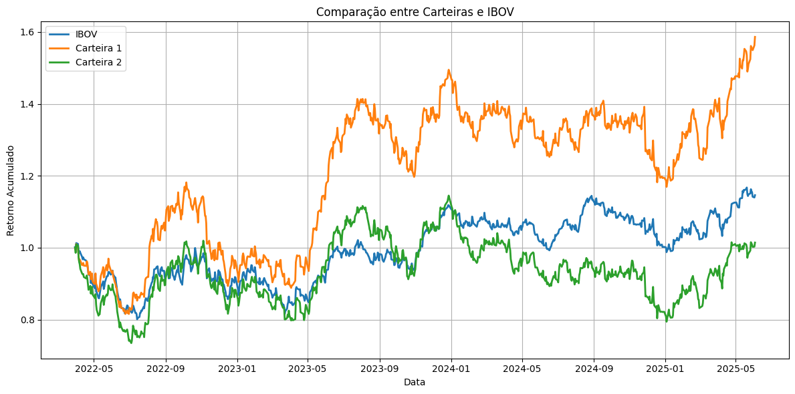
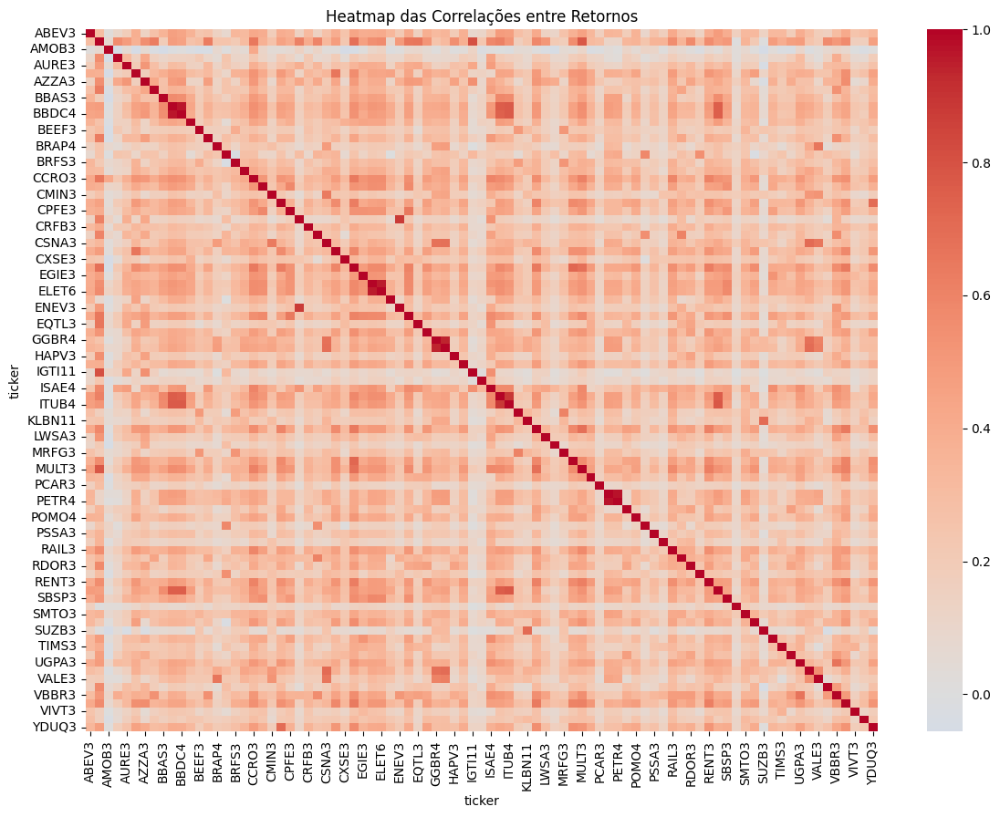
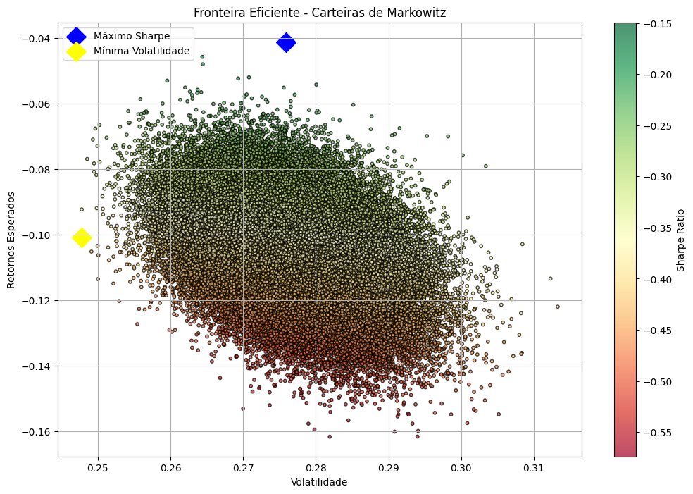

## 📊 Análise Estratégica da Carteira Bovespa
A análise dos gráficos e métricas obtidas neste projeto revelou insights valiosos para decisões de investimento, tanto na gestão de portfólio quanto na definição de estratégias para maximizar retornos e minimizar riscos.

## 🔍 Principais Conclusões
# 1️⃣ Diversificação e Correlação
A matriz de covariância dos retornos e o heatmap da carteira escolhida indicam baixa correlação entre os ativos.
Esse cenário é ideal para portfólios de investimento, pois reduz o risco sistêmico e aumenta a resiliência frente a oscilações de mercado.

# 2️⃣ Desempenho e Risco
Expectativa de Retorno: Superior ao IBOV (principal índice do mercado brasileiro).

Sharpe Ratio: ≈ 1,84 → Excelente relação risco/retorno.

Volatilidade: ≈ 0,54, indicando risco relativamente baixo para o nível de retorno esperado.

A simulação foi realizada por Monte Carlo, garantindo uma visão probabilística da performance com diferentes combinações de pesos.

# 3️⃣ Potencial de Aprimoramento com Machine Learning
O uso de modelos de Machine Learning poderia identificar combinações de ativos mais eficientes de forma consistente e automatizada.

Estratégias baseadas em aprendizado supervisionado e reforço poderiam ajustar a carteira de acordo com mudanças de mercado.

Observação: Caso o pagamento de dividendos tivesse sido considerado, a composição final da carteira provavelmente seria diferente.

## 📈 Implicações para o Negócio
Gestão de Risco: Uma carteira descorrelacionada e com Sharpe elevado representa segurança e estabilidade para investidores.

Posicionamento Estratégico: Superar o IBOV reforça a atratividade para fundos e investidores institucionais.

Inovação: Incorporar técnicas de IA e ML pode otimizar retornos e garantir vantagem competitiva.

## 📊 Visualização

